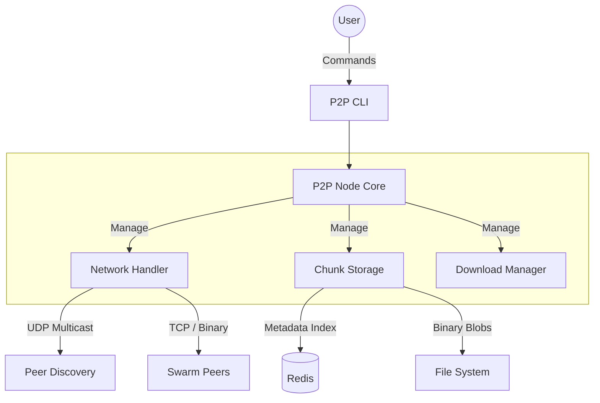

# P2P File Distribution System

**Tech Stack:** Java 21, Netty 4.1, Redis, Docker

A decentralized, high-throughput file distribution node built in Java. This system implements a custom application-layer binary protocol over TCP/NIO, designed to bypass the overhead of HTTP for raw chunk-based data transfer.

## Key Features

* **Custom Binary Protocol:** Designed a lightweight wire protocol (`[Type(1)][SenderLen(2)][Sender][Payload]`) with Netty length-field framing for transport.
* **Non-Blocking Network Layer:** Used Netty (NIO) to implement a Reactor pattern via EventLoops. This architecture enables the node to maintain concurrent peer connections and handle asynchronous chunk requests without the memory overhead of a traditional thread-per-connection model.
* **Two-Tier Storage:** Implemented a two-tier storage system using **Redis** for O(1) metadata lookups and local disk for blob persistence. **Bloom Filters** check chunk availability, eliminating unnecessary disk I/O.
* **Adaptive Load Balancing:** Implemented a cost-based peer scoring algorithm using weighted real-time latency, error rates, and saturation metrics, with a circuit breaker to exclude unhealthy peers.
* **Transport Security:**  Secured peer connections with **TLS 1.3** encryption via Netty's SSL pipeline.
* **Traffic Shaping:** Integrated a semaphore-based **backpressure** controller to reject excess requests under concurrent load.

## System Architecture

The architecture consists of independent nodes that use UDP multicast for local discovery and persistent TCP connections for data exchange.



## Getting Started

### Prerequisites
* Java 21+
* Maven 3.6+
* Redis (Standard port 6379)

### Build and Run
The project uses Maven for build and execution.

1.  **Build the Project:**
    ```bash
    mvn clean package
    ```

2.  **Start a Node:**
    ```bash
    mvn exec:java -Dexec.mainClass="com.p2p.filesystem.P2PMain"
    ```

## CLI Usage

To test the system locally, you should run **two separate terminal windows** to simulate a network (Node A on port 8080, Node B on port 8081).

1.Start the Nodes

Run these commands in separate terminals to create the mesh.
```bash
# Terminal A (Seeder)
mvn exec:java -Dexec.mainClass="com.p2p.filesystem.P2PMain" -Dexec.args="8080"

# Terminal B (Downloader)
mvn exec:java -Dexec.mainClass="com.p2p.filesystem.P2PMain" -Dexec.args="8081"
```
2.Index a File (Terminal A)

Splits a local file into chunks, calculates hashes, and registers metadata in Redis.
```text
p2p> add /path/to/my_video.mp4
Indexed file ID: 550e8400-e29b-41d4-a716-446655440000 // A unique file ID will be generated for every file you add.
```
3.Check Status (Terminal B)

Verify that Node B has discovered Node A (Peers should be 1).
```text
p2p> status
Peers: 1 | Files: 1 | Storage: 0 chunks (0 MB)
```
4.Download a File (Terminal B)

Initiates a parallelized download from the swarm (Node A).
```text
p2p> download 550e8400-e29b-41d4-a716-446655440000 ./downloads/video_copy.mp4
Downloading...
Download complete!
```

*Test with large files. The system downloads chunks from available peers in parallel and reconstructs the original file locally.*

## Observability
```text
The node exposes internal metrics for monitoring:
Metrics Endpoint: GET /metrics (Prometheus compatible)

Health Check: GET /api/health

Real-time Stats: GET /api/stats
```
## Configuration
Key performance tunables are configurable via `P2PConfiguration`. If file exists at `src/main/resources/application.properties`, it will be loaded automatically:
```text
node.port: TCP port for data transfer.

storage.chunkSize: Binary chunk size (default: 256KB).

discovery.enabled: Toggle for UDP multicast presence.
```
## Benchmarks

```text
# Set mainClass in pom.xml to com.p2p.filesystem.benchmark.LoadTestHarness, then:
mvn compile exec:java
```

Sustains ~34 MB/s end-to-end transfer throughput on localhost with TLS 1.3, verified with SHA-1 integrity checks. See `LoadTestHarness.java` for full results.

## License
See `LICENSE` for more information.